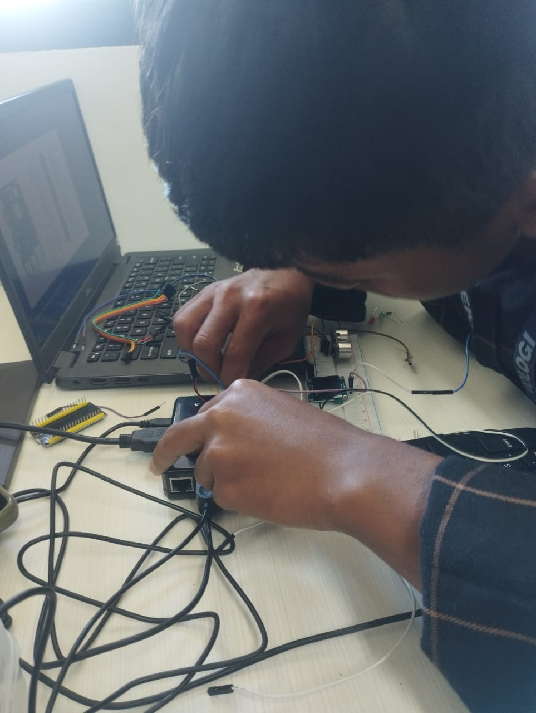
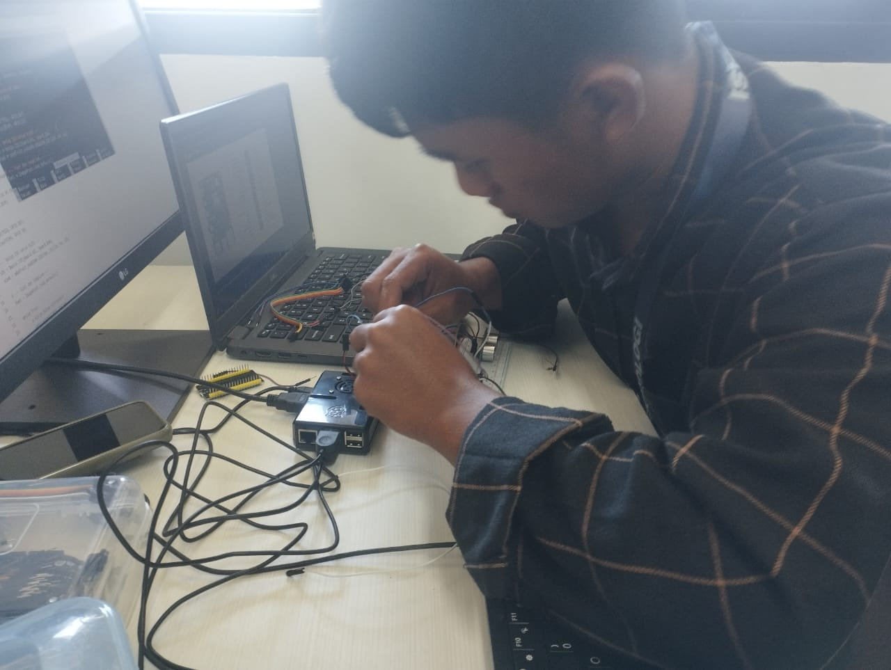

# LAPORAN PRAKTIKUM SENSOR ULTRASONIK HC-SR04 DENGAN RASPBERRY PI
Mencoba mengoperasikan Raspberry Pi dan integrasi sensor
## Anggota Kelompok
|Nama|NRP|
|----|---|
|Rayka Dharma Pranandita  | 5027241039|
|Muhammad Khosyi Syehab   | 5027241089|
|Zaenal Mustofa        | 5027241018|

### **Overview:**     
Dalam penugasan ini kami melakukan dua project atau dua tes, pertama implementasi sensor ultrasonik pada raspberry pi (**success**) dan implementasi sensor ultrasonik yang dioutput ke layar OLED (**gagal**)

### **Pendahuluan**      
Sensor ultrasonik HC-SR04 merupakan sensor yang digunakan untuk mengukur jarak suatu objek dengan memanfaatkan gelombang suara ultrasonik. Prinsip kerjanya adalah dengan memancarkan gelombang ultrasonik melalui pin *trigger* dan menerima pantulan gelombang tersebut melalui pin *echo*. Lama waktu pantulan kembali digunakan untuk menghitung jarak objek terhadap sensor.

Dalam praktikum ini, Raspberry Pi digunakan sebagai mikrokontroler yang mengatur pengiriman dan penerimaan sinyal ultrasonik, serta menampilkan hasil pengukuran jarak pada terminal.

---

### **Tujuan**
Tujuan dari percobaan ini adalah:
1. Memahami cara kerja sensor HC-SR04 dalam mengukur jarak menggunakan gelombang ultrasonik.  
2. Mengimplementasikan komunikasi input-output digital pada Raspberry Pi menggunakan pustaka `RPi.GPIO`.  
3. Menampilkan hasil pengukuran jarak secara real-time melalui terminal.
---

### **Dasar Teori**
Sensor ultrasonik HC-SR04 bekerja berdasarkan **prinsip pantulan gelombang suara (echo)**. Sensor ini terdiri dari dua bagian utama, yaitu:
- **Transmitter (Trigger)**: Mengirimkan gelombang ultrasonik dengan frekuensi sekitar 40 kHz.
- **Receiver (Echo)**: Menerima pantulan gelombang dari objek.

Waktu tempuh gelombang dari transmitter ke objek dan kembali ke receiver diukur, kemudian dikonversi menjadi jarak dengan rumus:
``
Jarak (cm) = Waktu tempuh (sekon) * 34300 / 2
``
dengan 34300 cm/s adalah kecepatan suara di udara

---
### **Alat dan Bahan**
- 1 unit Raspberry Pi (misalnya Raspberry Pi 4 Model B)
- 1 sensor ultrasonik **HC-SR04**
- Kabel jumper (male-female)
- Breadboard (opsional)
- Layar monitor atau SSH terminal untuk menampilkan output

---

### **Rangkaian**
Hubungkan pin sensor HC-SR04 ke Raspberry Pi sebagai berikut:

| Pin HC-SR04 | Pin Raspberry Pi (BCM) | Keterangan |
|--------------|-------------------------|-------------|
| VCC          | 5V                      | Tegangan daya sensor |
| GND          | GND                     | Ground |
| TRIG         | GPIO 23                 | Pin output pemicu gelombang |
| ECHO         | GPIO 24                 | Pin input penerima pantulan |

---

### **Kode Program**
```python
import RPi.GPIO as GPIO
import time

# Gunakan penomoran BCM
GPIO.setmode(GPIO.BCM)

# Atur GPIO
TRIG = 23
ECHO = 24

GPIO.setup(TRIG, GPIO.OUT)
GPIO.setup(ECHO, GPIO.IN)

def hitung_jarak():
    # Set TRIG rendah untuk memastikan tidak ada pulsa
    GPIO.output(TRIG, False)
    time.sleep(0.5)

    # Kirim pulsa selama 10 mikrodetik
    GPIO.output(TRIG, True)
    time.sleep(0.00001)
    GPIO.output(TRIG, False)

    # Waktu sinyal mulai
    while GPIO.input(ECHO) == 0:
        waktu_mulai = time.time()

    # Waktu sinyal diterima kembali
    while GPIO.input(ECHO) == 1:
        waktu_akhir = time.time()

    durasi = waktu_akhir - waktu_mulai

    # Kecepatan suara = 34300 cm/s
    jarak = durasi * 17150
    jarak = round(jarak, 2)

    return jarak

try:
    while True:
        jarak = hitung_jarak()
        print(f"Jarak: {jarak} cm")
        time.sleep(1)

except KeyboardInterrupt:
    print("Menghentikan program")
    GPIO.cleanup()
```

### Eksperimen menggunakan sensor ultrasonik dengan output terminal:
#### Hasil Akhir:

Bisa dilihat hasil perhitungan jarak dioutput secara real-time di terminal
```
Jarak: 24.7 cm
Jarak: 24.7 cm
Jarak: 26.7 cm

```

### Eksperimen menggunakan sensor ultrasonik dengan output OLED:

### Deskripsi Singkat
Program ini berfungsi untuk mengukur jarak objek menggunakan sensor ultrasonik HC-SR04 dan menampilkan hasil pengukurannya pada layar OLED SSD1306 yang terhubung ke Raspberry Pi melalui komunikasi I2C.

Cara kerjanya, Raspberry Pi mengirimkan sinyal trigger ke sensor ultrasonik untuk memancarkan gelombang suara, kemudian menunggu pantulan gelombang tersebut kembali ke pin echo. Selisih waktu antara pengiriman dan penerimaan gelombang digunakan untuk menghitung jarak berdasarkan kecepatan suara.

Nilai jarak yang diperoleh akan ditampilkan secara real-time pada layar OLED dan juga dicetak di terminal. Program berjalan terus-menerus dalam loop untuk melakukan pembacaan jarak secara berkelanjutan.
### **Kode Program**

```python
import time
import board
import busio
import adafruit_ssd1306
import RPi.GPIO as GPIO
from PIL import Image, ImageDraw, ImageFont

# --- Setup GPIO untuk HC-SR04 ---
GPIO.setmode(GPIO.BCM)
TRIG = 23
ECHO = 24
GPIO.setup(TRIG, GPIO.OUT)
GPIO.setup(ECHO, GPIO.IN)

# --- Setup I2C untuk OLED ---
i2c = busio.I2C(board.SCL, board.SDA)
oled = adafruit_ssd1306.SSD1306_I2C(128, 64, i2c)

# --- Font dan tampilan ---
font = ImageFont.load_default()

while True:
    # Kirim pulsa ultrasonik
    GPIO.output(TRIG, False)
    time.sleep(0.2)
    GPIO.output(TRIG, True)
    time.sleep(0.00001)
    GPIO.output(TRIG, False)

    while GPIO.input(ECHO) == 0:
        pulse_start = time.time()
    while GPIO.input(ECHO) == 1:
        pulse_end = time.time()

    duration = pulse_end - pulse_start
    distance = round(duration * 17150, 2)

    # Bersihkan layar OLED dan tampilkan jarak
    image = Image.new("1", (oled.width, oled.height))
    draw = ImageDraw.Draw(image)
    draw.text((10, 20), f"Jarak: {distance} cm", font=font, fill=255)
    oled.image(image)
    oled.show()

    print(f"Jarak: {distance} cm")
```
## Koneksi Pin
| Komponen     | Pin Raspberry Pi | Keterangan        |
| ------------ | ---------------- | ----------------- |
| HC-SR04 VCC  | 5V               | Daya sensor       |
| HC-SR04 GND  | GND              | Ground            |
| HC-SR04 TRIG | GPIO 23          | Pemicu sinyal     |
| HC-SR04 ECHO | GPIO 24          | Penerima pantulan |
| OLED VCC     | 3.3V             | Daya OLED         |
| OLED GND     | GND              | Ground            |
| OLED SDA     | GPIO 2 (SDA)     | Data I2C          |
| OLED SCL     | GPIO 3 (SCL)     | Clock I2C         |

## Kesimpulan  
Kesimpulan dari program ini adalah bahwa Raspberry Pi dapat digunakan sebagai mikrokontroler untuk membaca data jarak dari sensor ultrasonik HC-SR04 dan menampilkannya secara real-time pada layar OLED SSD1306.. Namun menghasilkan output yang gagal

#### Hasil Akhir:

    
Layar menghasilkan output bintik bintik hitam dengan background putih saja, tidak menampilkan output jarak sensor ultrasonik
## Documentation:




