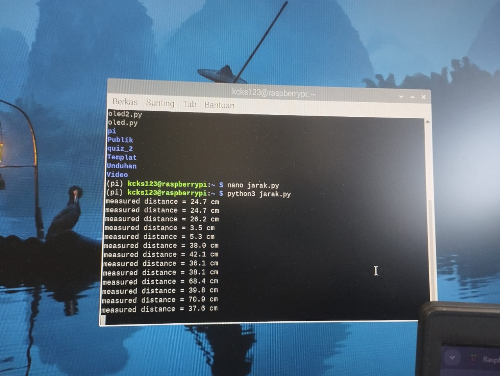
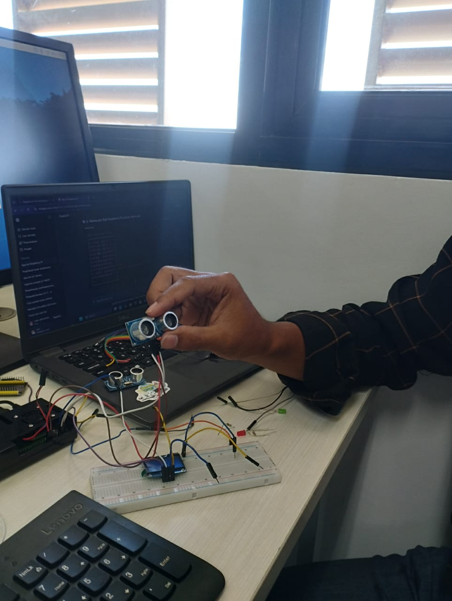
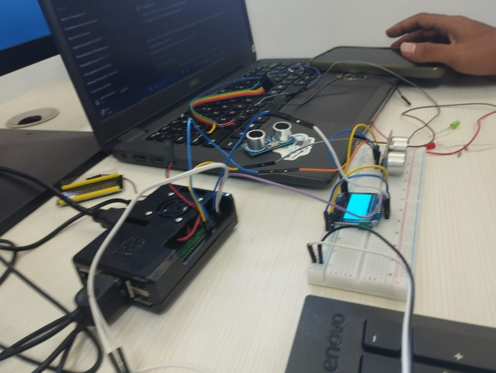
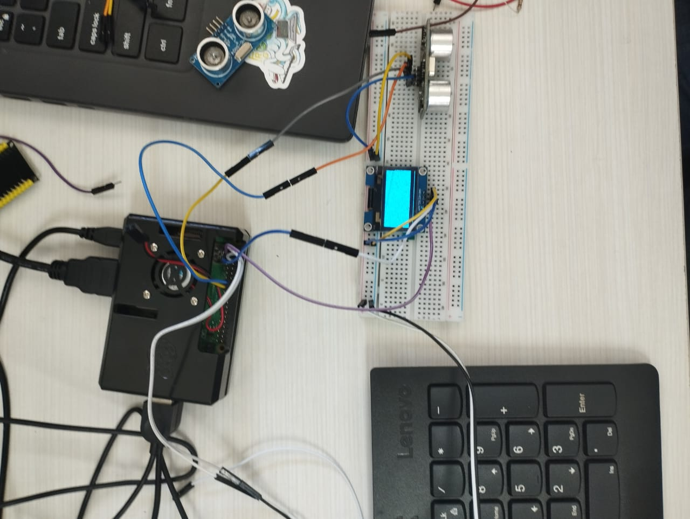
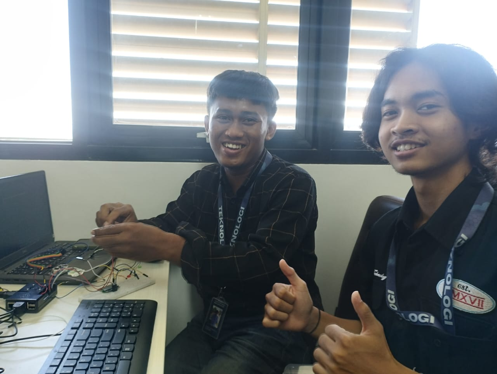
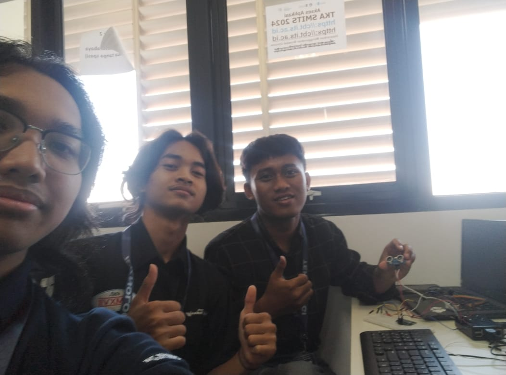

# Tugas Raspberry Pi
Mencoba mengoperasikan Raspberry Pi dan integrasi sensor
## Anggota Kelompok
|Nama|NRP|
|----|---|
|Rayka Dharma Pranandita  | 5027241039|
|Muhammad Khosyi Syehab   | 5027241089|
|Zaenal Mustofa        | 5027241018|

## Overview:    
Dalam penugasan ini kami melakukan dua project atau dua tes, pertama implementasi sensor ultrasonik pada raspberry pi (**success**) dan implementasi sensor ultrasonik yang dioutput ke layar OLED (**gagal**)

### Eksperimen menggunakan sensor ultrasonik dengan output terminal:
#### Hasil Akhir:

Bisa dilihat hasil perhitungan jarak dioutput secara real-time di terminal

### Eksperimen menggunakan sensor ultrasonik dengan output OLED:
#### Hasil Akhir:

    
Layar menghasilkan output bintik bintik hitam dengan background putih saja, tidak menampilkan output jarak sensor ultrasonik
## Documentation:

